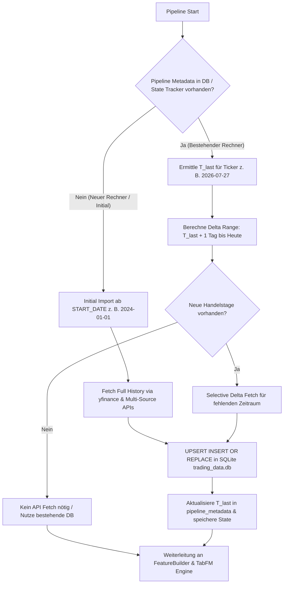

# 📋 Feature Spec: Multi-Source Data Ingestion & State Persistence

---

## 📌 Status
- **Status**: Active / In incremental Enhancement
- **Module**: `src/data/` (`db_manager.py`, `fetcher.py`, `run_analysis.py`)
- **Architecture**: Inkrementelle Data Ingestion Engine mit persistenter State-Nachverfolgung (SQLite Metadata Table + State Tracking).

---

## 🎯 Zweck & Funktionalität
Erfassung, Vorverarbeitung und Persistenz aller für das Swing-Predictor-Modell benötigten Markt- und Sentiment-Datenströme.
Das System merkt sich für jeden Ticker das Datum der letzten erfolgreichen Datenaktualisierung ($T_{last}$). Auf neuen Rechnern oder nach einem Reset erfolgt automatisch ein vollständiger Initial-Import ab `START_DATE`. Bei Folge-Durchläufen wird ausschließlich die Zeitspanne zwischen $T_{last} + 1\text{ Tag}$ und $T_{current}$ nachgeladen.

---

## 🔄 Persistenter State-Tracker & Inkrementelles Delta-Protokoll



---

## 🏗️ Spezifizierte Schnittstellen & Datenströme

### 1. State Tracking & Metadaten-Verwaltung (`db_manager.py`)
- **Tabelle `pipeline_metadata`**:
  ```sql
  CREATE TABLE IF NOT EXISTS pipeline_metadata (
      key TEXT PRIMARY KEY,
      value TEXT NOT NULL,
      updated_at TIMESTAMP DEFAULT CURRENT_TIMESTAMP
  );
  ```
- **Schlüssel-Schema**:
  - `last_data_date_{TICKER}`: ISO-Datumsstring des aktuellsten Handelstags in der DB (z. B. `"2026-07-27"`).
  - `last_run_timestamp`: Zeitstempel der letzten erfolgreichen Pipeline-Ausführung.
  - `data_status_{TICKER}`: Status-Flag (`"UP_TO_DATE"` | `"NEEDS_DELTA_UPDATE"` | `"INITIAL_SYNC_REQUIRED"`).

---

### 2. Markt- & Kursdaten Delta Fetcher (`fetcher.py`)
- **Quelle**: Yahoo Finance (`yfinance`) & Ergänzungs-APIs.
- **Initial Sync (Neuer Rechner)**:
  - Wenn `last_data_date_{TICKER}` nicht existiert $\rightarrow$ Abruf ab `START_DATE` (z. B. `2024-01-01`) bis $T_{today}$.
- **Delta Sync (Bestands-Rechner)**:
  - Wenn `last_data_date_{TICKER}` existiert $\rightarrow$ Abruf von $T_{last} + 1\text{ Tag}$ bis $T_{today}$.
- **Fusion & Persistenz**:
  - Zusammenführung alter und neuer Datenreihen ohne Duplikate (`~df.index.duplicated(keep='last')`).
  - Speicherung via `INSERT OR REPLACE` in `market_features` und Aktualisierung des Eintrags in `pipeline_metadata`.

---

### 3. Pipeline-Orchestrierung (`run_analysis.py`)
- Vor jedem Feature-Engineering-Schritt wird der Data Fetcher aufgefordert, den Ticker-State zu prüfen.
- Ausgabe von Log-Meldungen bezüglich des Status:
  - `[MarketDataFetcher] Initial Sync: Fetching full history for TSLA from 2024-01-01...`
  - `[MarketDataFetcher] Delta Sync: Fetching TSLA from 2026-07-28 to 2026-08-02...`
  - `[MarketDataFetcher] UP_TO_DATE: TSLA is already up to date (2026-08-02).`

---

## 🧪 Acceptance Criteria (Gherkin Spec)

```gherkin
Scenario: Initial Setup on a New Machine
  Given no local database or cache exists for ticker "TSLA"
  When the pipeline executes for the first time
  Then it MUST fetch historical data from START_DATE up to the current date
  And it MUST record "last_data_date_TSLA" in pipeline_metadata

Scenario: Subsequent Pipeline Execution (Incremental Delta)
  Given last_data_date_TSLA is recorded as "2026-07-27"
  And the current date is "2026-08-02"
  When the pipeline executes
  Then it MUST ONLY fetch data from "2026-07-28" to "2026-08-02"
  And it MUST update last_data_date_TSLA to "2026-08-02" in pipeline_metadata
```
