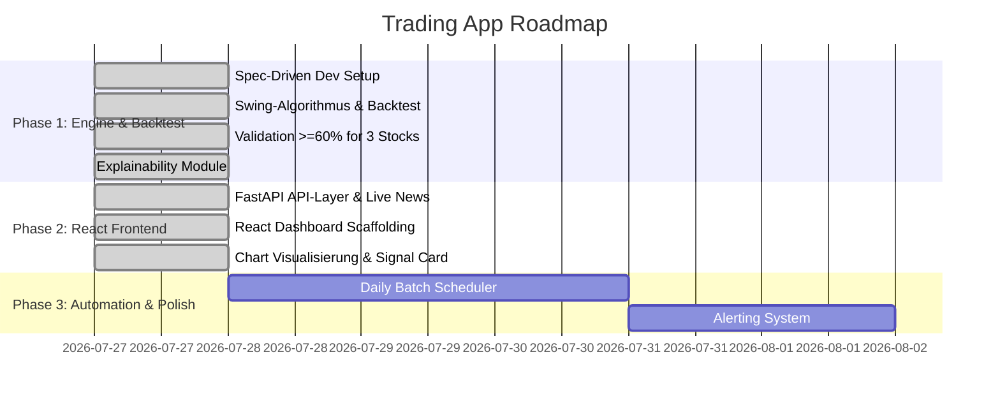

# 🗺️ Projekt-Roadmap

---

## 🎯 Meilensteine & Phasen im Überblick

---

## 📌 Phase 1: Swing Engine & Backtest-Proof (Abgeschlossen)

- [x] **SDD Architektur-Setup**: Erstellung von `specs/mission.md`, `specs/tech-stack.md` und `specs/roadmap.md`.
- [x] **Swing-Erkennungslogik (`src/`)**: 
  - Entwicklung mathematischer Indikatoren zur Früherkennung von Wendepunkten (z. B. RSI-Divergenzen, Moving Average Crossovers, Candlestick-Muster, Volumenaufbau).
- [x] **Backtesting Engine**:
  - Implementierung einer Backtest-Engine mit Kauf-/Verkaufsregeln, Stop-Loss und Profit-Target.
- [x] **Meilenstein 1 (Ziel 60 % Trefferquote)**:
  - Nachweis einer historisch nachgewiesenen Trefferquote von **≥ 60 %** bei **3 ausgewählten Fokus-Aktien** über mindestens 2 Jahre Vergangenheitsdaten.
- [x] **Explainability Engine**:
  - Automatische Erstellung von verständlichen Satz-Bausteinen ("Warum wird dieser Swing empfohlen?").

---

## 📌 Phase 2: React Frontend & Interaktive Visualisierung (Abgeschlossen)

- [x] **FastAPI REST Schnittstelle**:
  - Endpunkte für Aktuelle Signale, Backtest-Ergebnisse, Historie und Live-Nachrichten (`/api/news/{ticker}`).
- [x] **React SPA Dashboard (Vite)**:
  - Moderne, übersichtliche UI mit dunklem Theme (Glassmorphism), Ticker-Navigation und klarer Typografie.
- [x] **Signal Card, News Integrator & Begründungs-View**:
  - Präsentation der Empfehlungen inkl. der verständlichen Erklärung, Trefferwahrscheinlichkeit, Risikowerten und Live Google News Feed.
- [x] **TradingView / Lightweight Charts Integration**:
  - Visualisierung der EOD-Kerzen mit eingezeichneten Einstiegs-, Ziel- und Stop-Loss-Zonen sowie Signal-Markierungen.

---

## 📌 Phase 3: Alternative Data APIs & Signal Hardening (Aktiv)

- [x] **Finnhub Live API Integration**:
  - Live Company News Feed & Form 4 SEC Insider Disclosures für präzisere Swing-Signale.
- [ ] **Alpha Vantage Integration**:
  - Historische News-Sentiment-Zeitreihen & US-Makroindikatoren (10Y Yield, Fed Rate, Inflation).
- [ ] **Daily EOD Automation & Caching**:
  - Automatisiertes inkrementelles Delta-Update einmal täglich nach Börsenschluss.
- [ ] **Benachrichtigungssystem**:
  - Versenden von Top-Signalen des Tages per Email oder Telegram Bot.

---

## 📌 Phase 4: Automated Trading with Interactive Brokers (In Arbeit)

- [ ] **Feature F1: IBKR Connection Layer (`specs/features/ibkr-connection.md`)**:
  - TWS / IB Gateway API Anbindung via `ib_insync`.
  - Abrufen von Account Summary (Net Liquidity, Available Funds, Cash in CHF/USD) & Depot-Positionen.
  - Integration in FastAPI Endpunkte (`/api/broker/*`).
- [ ] **Feature F2: Order Execution Engine**:
  - Erstellen, Validieren und Ausführen von Orders (Market / Limit).
  - Order-Status-Tracking & Execution Reports.
- [ ] **Feature F3: Trading Strategy & Scheduler**:
  - Signal-to-Trade Mapping (Bullish Signal -> 3x Leveraged ETF Buy).
  - Position Sizing (~50 CHF), Take-Profit (+8%), Time Exit (5 Tage Max Hold).
- [ ] **Feature F4: Safety & Monitoring (Circuit Breaker & Kill Switch)**:
  - Max Daily Loss Protection, Single Position Cap, Dashboard Emergency Kill-Switch.

