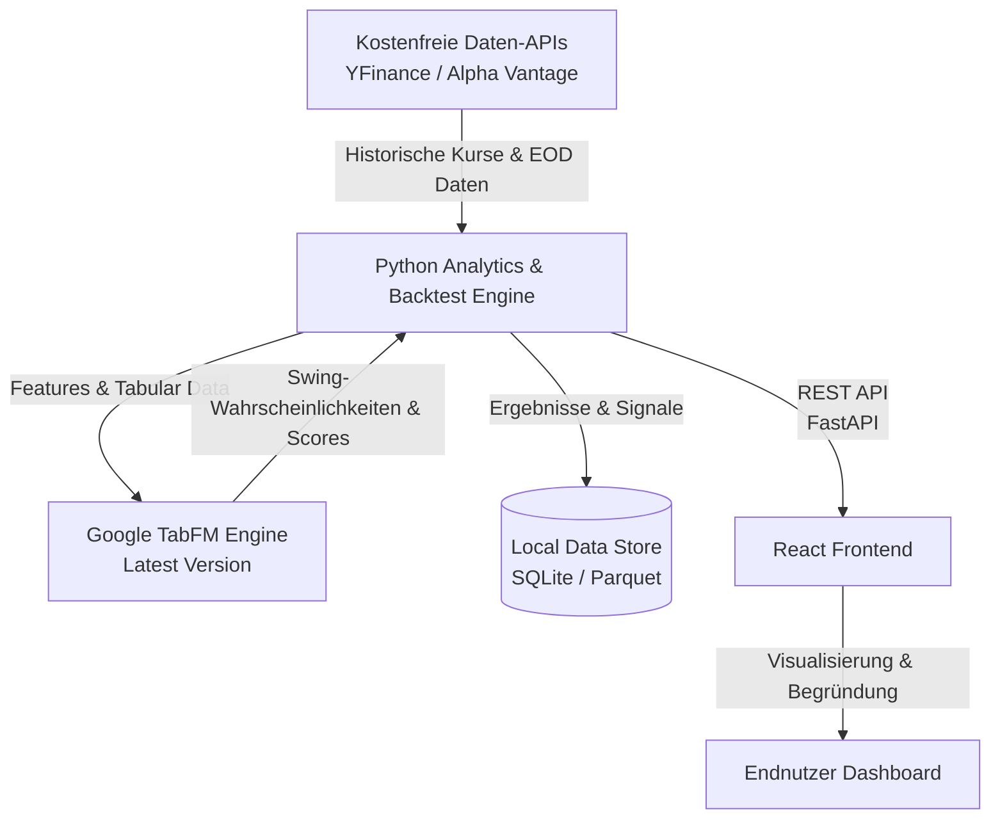

# 🛠️ Tech Stack & Systemarchitektur

---

## 🏗️ Übersicht der Komponenten

Das System folgt einer modernen entkoppelten Architektur mit einem Python-Analyse-Engine-Backend, Google TabFM Foundation-Model für KI-Analyse und einem React-basierten Single Page Application (SPA) Frontend.

---

## 🐍 Backend & Daten-Engine (Python)

- **Sprache**: Python 3.11+
- **Datenanalyse & Mathematik**: `pandas`, `numpy`, `pandas-ta` / `TA-Lib`
- **Backtesting Framework**: Eigene performante Backtesting-Engine (auf Pandas-Basis oder `backtrader` / `vectorbt`)
- **API Server**: `FastAPI` (schnell, typensicher, automatische OpenAPI-Dokumentation)
- **Persistenz**: SQLite / Parquet-Dateien in `data_store/` für schnellen lokalen Datenzugriff und Caching

---

## 🧠 AI / Foundation Model: Google TabFM

- **Komponente**: **Google TabFM** (`tabfm` / `.tabfm_src`)
- **Rolle**: Kern-KI-Modell für tabulare Zeitreihen-Analyse, Feature-Repräsentation und prädiktive Swing-Mustererkennung.
- **Anforderung**: Es muss **stets die aktuellste Version** von Google TabFM integriert und genutzt werden.

---

## 🌐 Frontend & User Interface (React)

- **Framework**: React 18+ (Vite)
- **Styling**: Modernes Responsive Design (Vanilla CSS / CSS Modules / Tailwind CSS v4)
- **Financial Charting**: `lightweight-charts` (TradingView Library) oder `Recharts` für performante Kerzencharts und Indikator-Overlays
- **State Management & Data Fetching**: TanStack Query (React Query) für sauberes API-Caching

---

## 📊 Datenquellen (Kostenfrei)

1. **YFinance (`yfinance`)** [Primär]:
   - Kostenfreie historische Tages- und EOD-Daten für weltweite Aktien und Indizes.
   - Kein API-Key erforderlich.
2. **Alpha Vantage / Stooq / Financial Modeling Prep** [Fallback]:
   - Ergänzende Datenquellen für Fundamentaldaten oder Validierung von Preisdaten.

---

## 🔍 Explainability Engine (Signal-Begründung)

- **Modul**: `src/explainability/`
- **Funktion**: Generierung menschlich verständlicher Erklärungen für Treffer (z. B. *"Aktie X zeigt einen 85% Swing-Score durch Google TabFM: RSI (32) überverkauft + Bullischer Hammer an Support-Linie + Hist. Backtest-Trefferquote 64% über 50 Trades"*).
